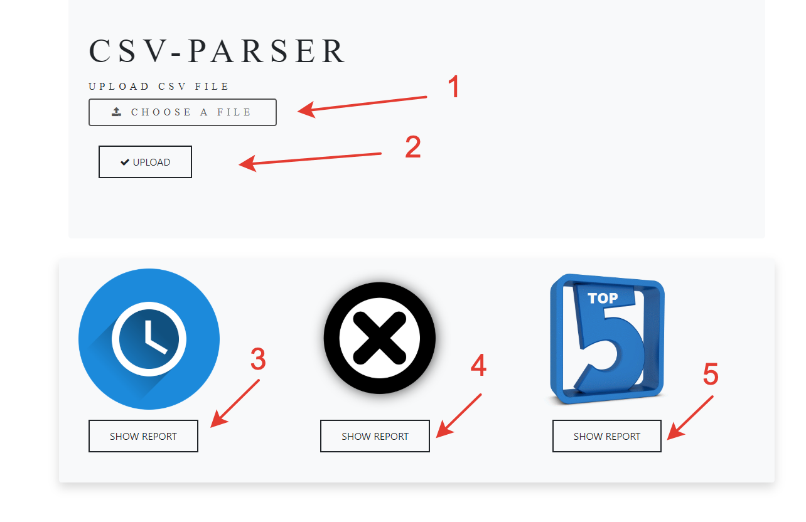

Инструкция по использованию CSV Parser
================================
## Конфигурация
1. В приложение используется база данных Postgres с параметрами:
Url: postgresql://localhost:5432/csv_parser
- Login/password: user/1234
- При необходимости измените настройки подключения к БД в файле postgres.properties
2. Для инициализации таблицы с необходимыми параметрами используйте скрипт InitDB.sql
3. Для включения функции очистки базы при запуске приложения в файле spring-db.xml раскомментируйте блок </jdbc:initialize-database>

## Описание приложения

Приложение CSV Parser используется для импорта CSV-файлов c опрелененной структурой (см. структуру)
При импорте содержимое файла преобразуется в Java-объекты и сохраняется в базу Postgres для дальнейщего использования
После импорта в приложение можно посмотреть три типа отчетов, которые отображаются на разных HTML страницах

- Список пользователей и используемые ими формы за последний час

- Пользователи, которые начали активность на форме и не дошли до конца для услуг grp dszn_*

- ТОП – 5 самых используемых форм

При повторном импорте старые данных удаляются из БД

Импорт больших файлов может занимать длительное время

## Пример использования
1. Выберите CSV-файл для загрузки
2. Нажмите кнопку импорта файл. После загрузки файла будет доступно формирование отчетов
3. Отчет со списком пользователей и используемых ими форм за последний час
4. Отчет со списком пользователей, которые начали активность на форме и не дошли до конца
5. Отчет со списком самых используемых форм

## Структура CSV-файла
Имена столбцов: ssoid	ts	grp	type	subtype	url	orgid	formid	code	ltpa	sudirresponse	ymdh

ssoid – Уникальный идентификатор пользователей

ts – Время

grp - Группа события

type – Тип события

subtype – Подтип события

url – Адрес с которого пришло событие

orgid – Организация предоставляющая услугу

formid – Идентификатор формы

code - Код формы

ltpa – Ключ сессии (в данном наборе пустой)

sudirresponse – Ответ от сервиса авторизации (в данном наборе пустой)

ymdh – Дата в формате YYYY-MM-DD-HH